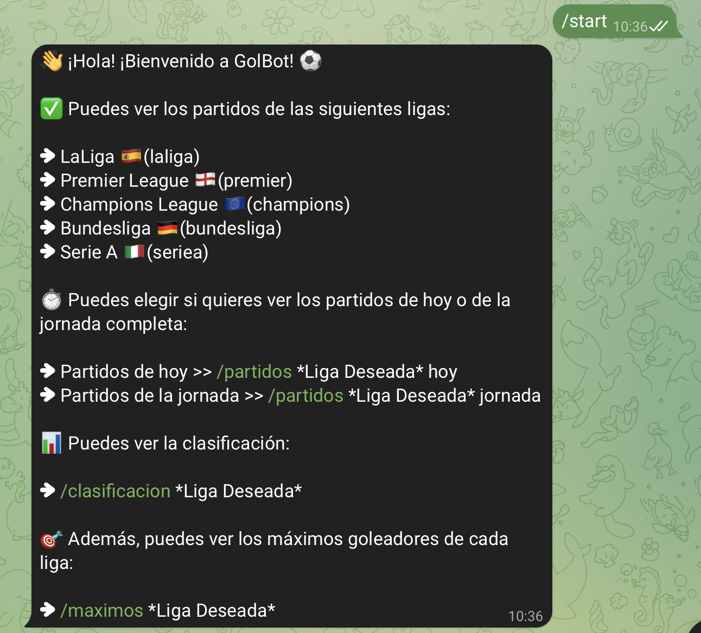
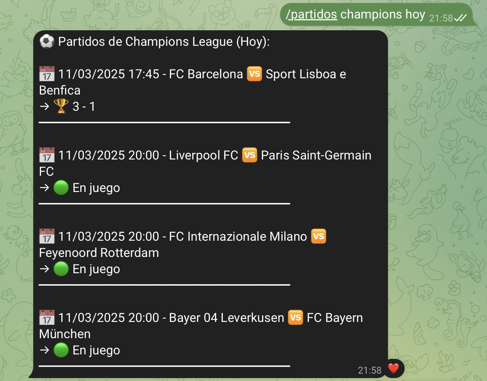
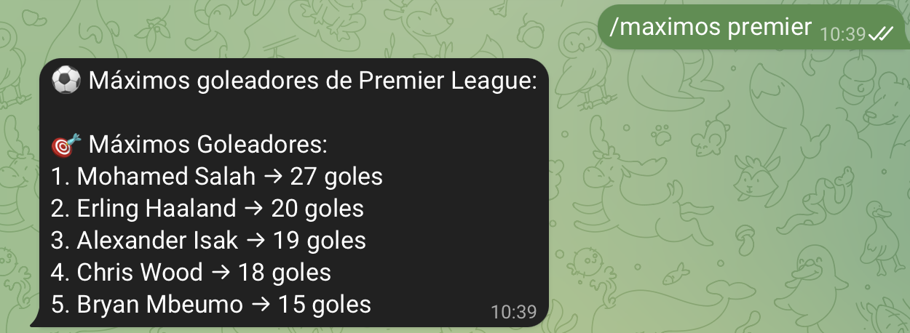
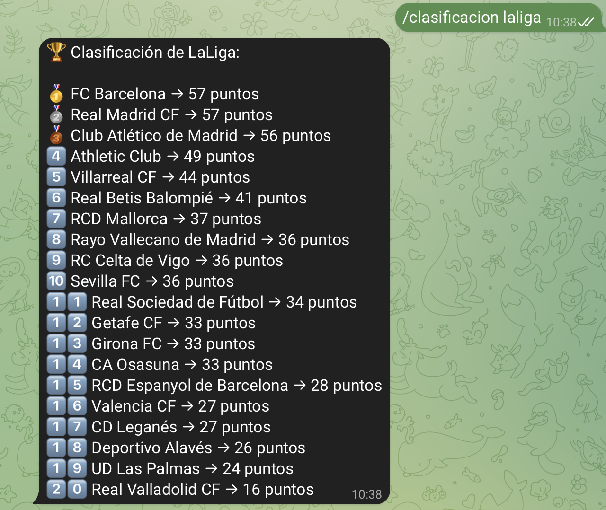

# GolBot

## **1. ¿Qué necesitas antes de empezar?**

Antes de ejecutar el bot, asegúrate de cumplir con los siguientes requisitos:

### 1.1. **¿Tienes Python instalado?**

Python es necesario para ejecutar este programa. Para verificar si lo tienes:

1. Abre la terminal:
    - En Windows: Presiona `Win + R`, escribe `cmd` y presiona Enter.
    - En macOS/Linux: Busca "Terminal" en tu sistema y ábrela.
2. Escribe el siguiente comando y presiona Enter:
    
    ```
    python --version
    ```
    
    o si no funciona:
    
    ```
    python3 --version
    ```
    
    - Si ves algo como `Python 3.x.x`, ya está instalado.
    - Si no aparece, descárgalo desde [python.org](https://www.python.org/downloads/) e instálalo. **Importante:** Marca la opción **Add Python to PATH** durante la instalación.

### 1.2. **¿Tienes el archivo del bot?**

El archivo del bot se llama `GolBot.py`. Asegúrate de tenerlo en tu ordenador y saber en qué carpeta está ubicado.

---

## **2. Cómo ejecutar el bot**

### 2.1. **Abre la terminal**

- En Windows: Abre `cmd` o PowerShell (`Win + R`, escribe `cmd` y presiona Enter).
- En macOS/Linux: Abre la aplicación "Terminal".

### 2.2. **Muévete a la carpeta del archivo**

Para ejecutar el bot, primero necesitas estar en la carpeta donde guardaste `GolBot.py`. Usa el comando `cd` para moverte:

- Si guardaste el archivo en tu carpeta de Documentos:
    - En macOS/Linux:
        
        ```
        cd ~/Documentos
        ```
        
    - En Windows:
        
        ```
        cd C:\Usuarios\TuUsuario\Documentos
        ```
        

Para asegurarte de que el archivo está en esa carpeta, escribe:

```
ls  # En macOS/Linux
dir # En Windows
```

Deberías ver `GolBot.py` en la lista de archivos.

### 2.3. **Ejecuta el bot**

El bot se ejecuta con Python. Para iniciar el bot, usa uno de los siguientes comandos, dependiendo de cómo esté configurado tu sistema:

- Si tu sistema usa `python`:
    
    ```
    python GolBot.py
    ```
    
- Si tu sistema usa `python3`:
    
    ```
    python3 GolBot.py
    ```
    

El bot comenzará a funcionar y podrás interactuar con él a través de Telegram.

---

## **3. Cómo usar el bot**

### 3.1. **Comando `/start`**

El comando `/start` da la bienvenida al usuario y muestra las opciones disponibles:

- Muestra las ligas disponibles para consultar.
- Ofrece comandos para ver los partidos de hoy, la jornada completa, la clasificación y los máximos goleadores.

### 3.2. **Comando `/partidos`**

El comando `/partidos` permite al usuario obtener información sobre los partidos de una liga en una fecha específica. Debes usar el comando de la siguiente manera:

- Partidos de hoy:
    
    ```
    /partidos laliga hoy
    ```
    
- Partidos de la jornada:
    
    ```
    /partidos laliga jornada
    ```
    

Si no se especifica correctamente la liga o el modo (hoy/jornada), el bot te pedirá que lo hagas correctamente.

### 3.3. **Comando `/clasificacion`**

El comando `/clasificacion` permite consultar la clasificación actual de una liga. Debes usar el comando de la siguiente manera:

```
/clasificacion laliga
```

Este comando devuelve una lista con los equipos clasificados y sus puntos.

### 3.4. **Comando `/maximos`**

El comando `/maximos` muestra los máximos goleadores de una liga. Debes usar el comando de la siguiente manera:

```
/maximos laliga
```

Este comando devuelve una lista de los jugadores con más goles en la liga seleccionada.

### 3.5. **Errores comunes**

- Si se omite la liga o el parámetro (hoy/jornada) en los comandos, el bot te pedirá que los incluyas.
- Si la liga no es válida, el bot informará que la liga seleccionada no existe.
- Si el bot no puede obtener los datos de la API de Football-Data.org, te mostrará un mensaje de error.

---

## **4. Explicación del código**

### 4.1. **Módulos utilizados**

- `requests`: Se usa para hacer peticiones HTTP a la API de Football-Data.org.
- `telebot`: Biblioteca para interactuar con el API de Telegram y crear el bot.
- `datetime` y `pytz`: Para manejar fechas y horas, ajustando la zona horaria a la de Madrid (Europe/Madrid).

### 4.2. **Funciones principales**

- **`start()`**: Envia un mensaje de bienvenida con las opciones del bot cuando se inicia.
- **`obtener_partidos()`**: Obtiene los partidos de la liga especificada (hoy o de la jornada).
- **`obtener_clasificacion()`**: Obtiene la clasificación de la liga seleccionada.
- **`obtener_maximos()`**: Muestra los máximos goleadores de la liga seleccionada.
- **`formatear_partido()`**: Da formato a la información de cada partido para presentarla de manera clara.

### 4.3. **Consideraciones de uso**

Este bot utiliza la API de Football-Data.org, que tiene un límite de peticiones. Asegúrate de no hacer demasiadas peticiones en un corto período de tiempo para evitar bloqueos. Además, la API puede no estar disponible temporalmente, en cuyo caso el bot no podrá obtener los datos.

⚠️ **¡Importante!** El bot solo funciona **ejecutandose el archivo de python**, si no se ejecuta el bot **no** funciona.

# Ejemplos

### /start

Al usar `/start` se mostrará el siguiente mensaje:



### /partidos

Al usar `/partidos`, seguidos de la liga deseada y de `hoy` o `jornada` (en este caso es `hoy`)se mostrará el siguiente mensaje (teniendo en cuenta que si el partido ya ha finalizado pondra el resultado y si esta en juego se mostrara `🟢 En juego`):



### /maximos

Al usar `/maximos` se mostrará el siguiente mensaje con los maximos goleadores de la liga selecionada:



### /clasificacion

Al usar `/clasificacion` se mostrará el siguiente mensaje con la clasificación de la liga selecionada:


